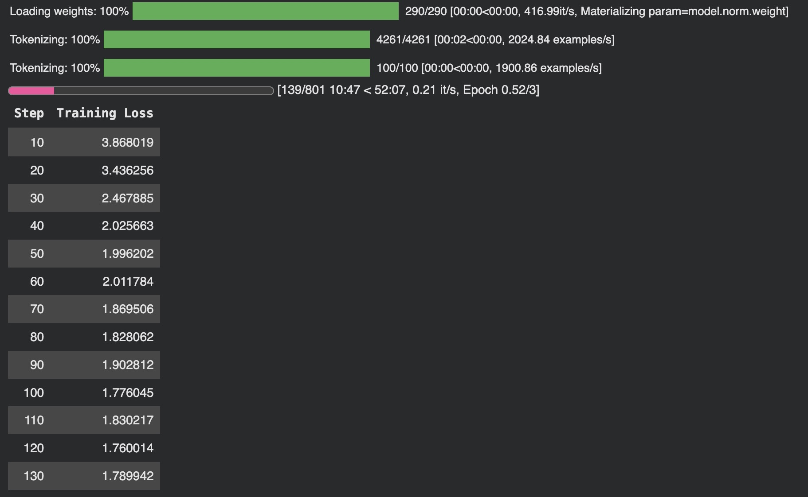
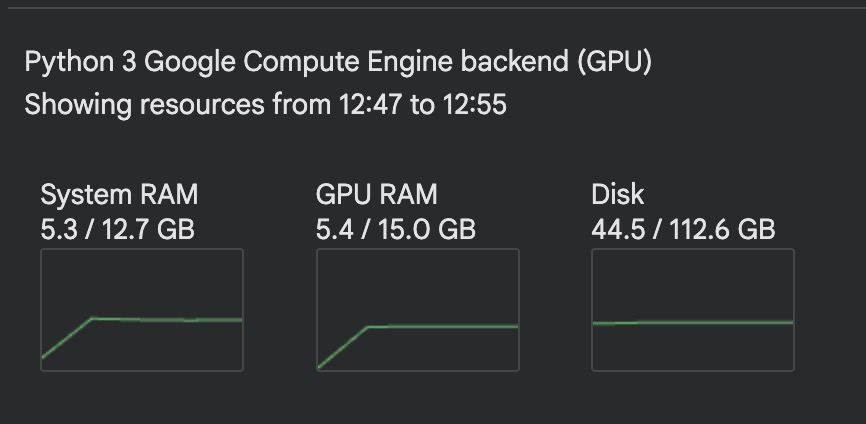
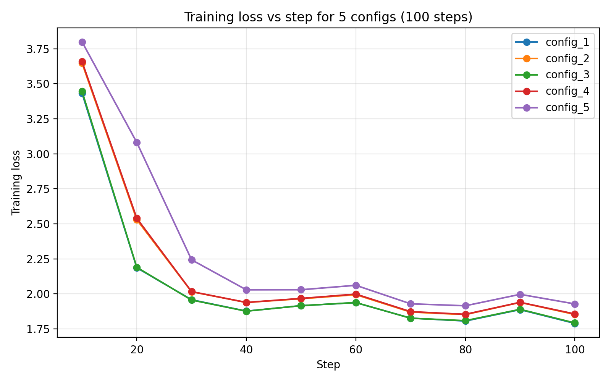
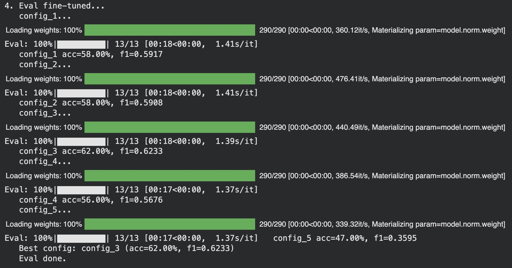

# Individual Assignment Report: Market Greed / Panic Sentiment Prediction

**Gen AI with LLMs — Individual Assignment**

---

## 1. Task Definition

I fine-tune an open-weight LLM to perform **text classification** on financial text: each input sentence is assigned one of three **market sentiment** labels:

| Label    | Description                    |
|----------|--------------------------------|
| **Greed**  | Bullish / positive sentiment  |
| **Neutral**| No strong directional bias    |
| **Panic**  | Bearish / negative sentiment  |

**Dataset:** [Financial PhraseBank](https://www.researchgate.net/publication/251231364_FinancialPhraseBank-v10), loaded from Hugging Face as `cyrilzhang/financial_phrasebank_split`. Original labels (positive / neutral / negative) are mapped to Greed / Neutral / Panic. Total size ~4,361 samples; I use a held-out evaluation set of 100 samples.

**Base model:** Qwen 2.5 0.5B Instruct (`Qwen/Qwen2.5-0.5B-Instruct`), open-weight, small enough for feasible training on limited hardware.

---

## 2. Training Process

### 2.1 Fine-tuning method (LoRA / QLoRA)

I use **LoRA** (Low-Rank Adaptation) for parameter-efficient fine-tuning:

- **Why LoRA (vs full fine-tuning):** Reduces GPU memory; only low-rank adapter weights are trained while the base model is frozen; commonly used for instruction-tuning LLMs. Where available I use **4-bit quantization** (QLoRA) for the base model to further reduce memory.
- **Target modules:** `q_proj`, `k_proj`, `v_proj`, `o_proj`, `gate_proj`, `up_proj`, `down_proj`. LoRA rank `r` and scale `lora_alpha` are varied across configs (see below).

Training format is **instruction-style**: each sample is formatted as “Instruction: … Input: &lt;sentence&gt; Output: &lt;label&gt;” and the model is trained with causal language modeling (next-token prediction) on the full sequence.

### 2.2 Precision and optimization techniques

I use several standard training techniques to make fine-tuning feasible and stable on limited hardware:

- **Numerical precision (bf16 / fp16 / fp32).** Mixed precision (preferably **bf16**) reduces memory usage and enables larger effective batch sizes.
- **Gradient accumulation.** I use `per_device_train_batch_size=4` and `gradient_accumulation_steps=4` (effective batch 16) to emulate a larger batch without exceeding GPU memory.
- **Learning‑rate schedule and warmup.** A **cosine** schedule with **10% warmup** stabilizes early training and lets the learning rate decay smoothly.
- **Regularization.** A small **weight decay** of `0.01` helps prevent overfitting on the relatively small dataset.

These techniques work together with LoRA/QLoRA: quantization and mixed precision reduce memory usage, while gradient accumulation and the scheduler make training stable and efficient given the 100‑step budget.

### 2.3 Hyperparameter tuning (5 configs)

I planned to test **five** hyperparameter configurations, varying learning rate and LoRA rank. Training length is fixed at **100 steps** (see §2.4).

| Config    | Learning rate | LoRA rank (r) | max_steps |
|-----------|----------------|---------------|-----------|
| config_1  | 2e-4           | 8             | 100       |
| config_2  | 1e-4           | 8             | 100       |
| config_3  | 2e-4           | 16            | 100       |
| config_4  | 1e-4           | 16            | 100       |
| config_5  | 5e-5           | 16            | 100       |

Other settings (shared): `lora_alpha=16`, `per_device_train_batch_size=4`, `gradient_accumulation_steps=4`, `max_seq_length=256`, `warmup_ratio=0.1`, `weight_decay=0.01`, `lr_scheduler_type="cosine"`, bf16 mixed precision. 

### 2.4 Training signal and stopping

I monitored **training loss**. On the first config, loss reached a plateau after approximately 100 steps (see **Figure 1**), indicating that the model converges quickly on this dataset. I therefore fixed **max_steps = 100** for all five configs so that (1) training is short and reproducible, and (2) I can compare configs under the same training length. No separate validation set is used for early stopping; the evaluation set is held out and used only for final metrics.

**Figure 1.** Training loss vs step; loss flattens around 100 steps.

  

### 2.5 Resource and memory tuning

**Setup before.** I started from a reasonable initial configuration but noticed that GPU memory usage was relatively low (only about 35% of GPU RAM). I then explored several alternative settings to increase utilization and speed, but most of them led to out-of-memory (OOM) errors, so I ultimately kept the original configuration.

**System resource usage status**

  

The table below summarizes the main configurations I tried:

| Trial | Train batch | Grad accum | Effective batch | Max seq length | Grad checkpointing | Eval batch | Result |
|------:|------------:|-----------:|----------------:|---------------:|-------------------:|----------:|--------|
| 1 | 16 | 2 | 32 | 256 | off | 24 | OOM |
| 2 | 8  | 4 | 32 | 256 | off | 16 | OOM |
| 3 | 4  | 8 | 32 | 256 | on  | 16 | OOM |
| 4 | 16 | 1 | 16 | 256 | off | 24 | OOM |
| 5 (final runnable) | 32 | 1 | 32 | 128 | off | 32 | Ran on Colab T4 (~0.20 it/s) |

**Outcome.** Across these trials, **only one configuration** (Trial 5) was able to run reliably; all others resulted in OOM errors on the available hardware. The final runnable configuration, executed in a **Python 3 Colab notebook with a single NVIDIA T4 GPU (≈12.7 GB RAM, 15.0 GB GPU RAM)**, achieved approximately **0.20 it/s**.

## 3. Evaluation

### 3.1 Metrics

- **Accuracy:** fraction of correct labels on the evaluation set.
- **F1 (macro):** macro-averaged F1 across the three classes (Greed, Neutral, Panic).

Evaluation is done by running the model in generative mode (instruction + input, then decode the output) and parsing the predicted label from the generated text (e.g. first occurrence of Greed/Neutral/Panic).

### 3.2 Base vs fine-tuned comparison

**Base model (no fine-tuning)** on the held-out evaluation set (100 samples):

| Model                  | Accuracy | F1 (macro) |
|------------------------|----------|------------|
| Base (Qwen 2.5 0.5B)   | 44.00%   | 0.3774     |

**Fine-tuned models:**

| Model      | Accuracy | F1 (macro) |
|------------|----------|------------|
| config_1   | 58.00%   | 0.5917     |
| config_2   | 58.00%   | 0.5908     |
| config_3   | 62.00%   | 0.6233     |
| config_4   | 56.00%   | 0.5676     |
| config_5   | 47.00%   | 0.3595     |

**Best config: `config_3` (62.00% accuracy, 0.6233 F1).**

  

  

**Key observations from training and evaluation.** From the training-loss curves, `config_1` and `config_3` behave very similarly, and `config_2` and `config_4` form another similar pair. Both **`config_1/3` clearly outperform `config_2/4`**, which in turn are better than **`config_5`**. This suggests that **LoRA rank (8 vs 16) has limited impact** compared to the **learning rate**, and that a **medium learning rate (`config_3`)** provides the best trade-off between convergence speed and stability; it also achieves the **best performance on the test set**.

## 4. Analysis and Reporting

### 4.1 Where the fine-tuned model improved (or did not)

- **Improvement over base model:**  
  All five fine-tuned configs were evaluated on the same 100-sample test set. Compared to the base model (**44.00% accuracy, 0.3774 F1**), `config_1`, `config_2`, `config_3`, and `config_4` all show clear gains:
  - **`config_1`**: 58.00% accuracy, 0.5917 F1 (≈ +14 pts accuracy, +0.214 F1)
  - **`config_2`**: 58.00% accuracy, 0.5908 F1 (≈ +14 pts accuracy, +0.213 F1)
  - **`config_3`**: 62.00% accuracy, 0.6233 F1 (≈ +18 pts accuracy, +0.246 F1)
  - **`config_4`**: 56.00% accuracy, 0.5676 F1 (≈ +12 pts accuracy, +0.190 F1)  
  **`config_5`** (47.00% accuracy, 0.3595 F1) is only slightly better than the base in accuracy and worse in F1, suggesting that too small a learning rate (with this training budget) underfits the task. Overall, `config_3` delivers the strongest improvement and is selected as the final configuration.

### 4.2 Limitation or failure mode

- **Limitations and failure modes:**  
  Qualitatively, I observed that the model still struggles with **ambiguous or mixed-sentiment sentences**, especially when short-term negative news appears in an otherwise positive macro context. The model also tends to confuse **Neutral vs Greed/Panic** when the wording is mild (for example, “slight gains” or “limited decline”) and can be sensitive to small phrasing changes. These behaviours are likely due to the **small dataset**, the limited number of training steps (100), and the fact that only low-rank adapters are trained while the base model remains frozen.
- **Alternative designs (future work):**  
  If I were to push performance further, I would consider training for more steps, using a slightly larger base model, or unfreezing the final transformer block in addition to the LoRA adapters, as well as augmenting the dataset with more diverse financial text.

---

## 5. Summary

I defined a three-class market sentiment task (Greed / Neutral / Panic), fine-tuned Qwen 2.5 0.5B with LoRA under five hyperparameter configs (fixed 100 steps, loss plateau observed), and evaluated with accuracy and macro F1. Base model performance is **44% accuracy, 0.3774 F1**, while the best configuration (`config_3`) achieves **62.00% accuracy and 0.6233 F1**, demonstrating a substantial improvement on this dataset. I documented the training techniques, resource constraints, and observed limitations so that another student can reproduce the setup and build on this work responsibly.